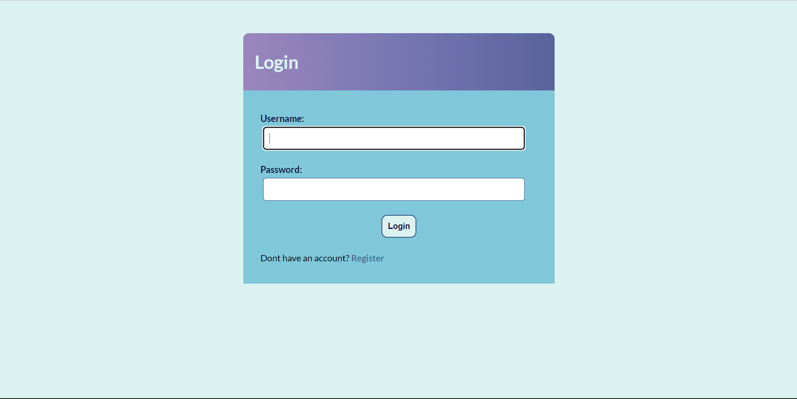
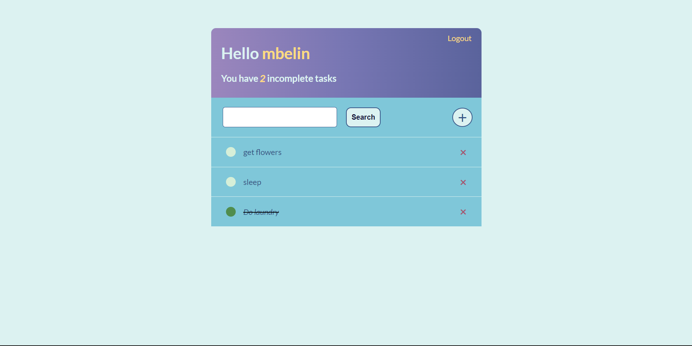
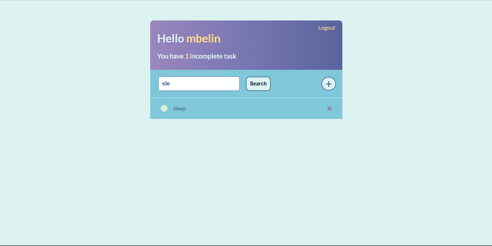

# todolist-django
- Functionalities: user registration, login, CRUD tasks, search task.
- This project is made based on this [Youtube tutorial](https://www.youtube.com/watch?v=llbtoQTt4qw).
- Application interface:

